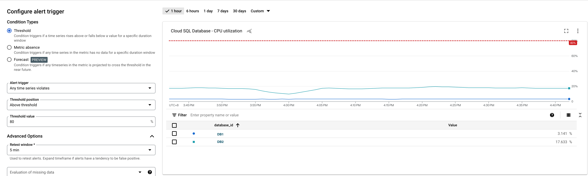
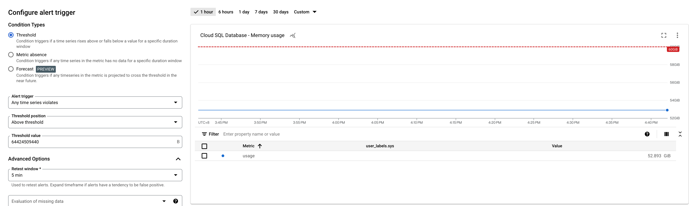
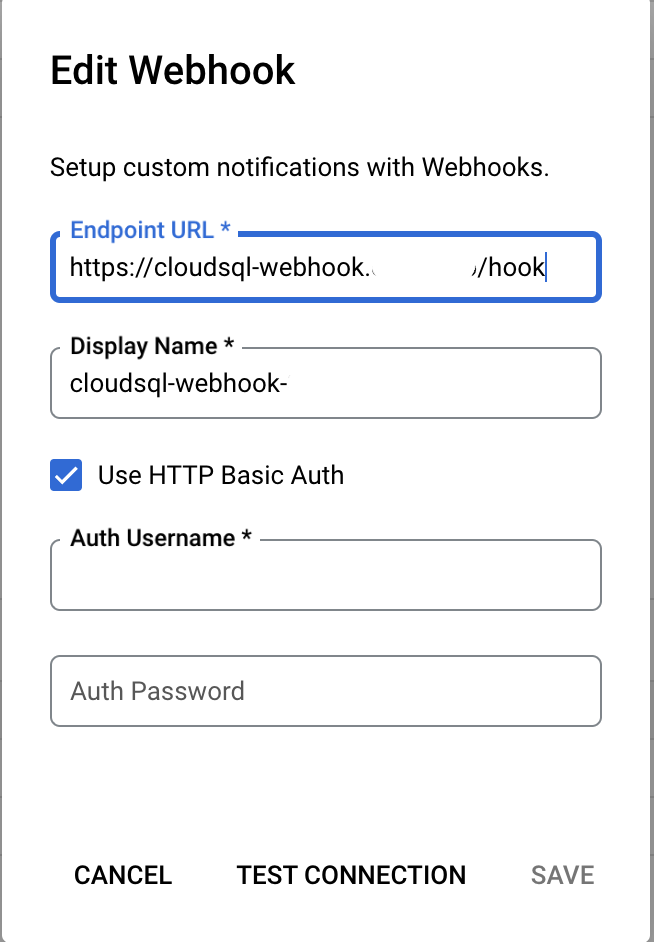
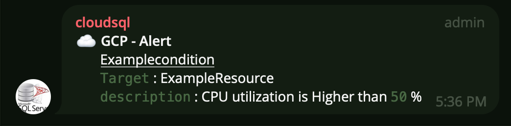

# GCP CloudSQL Alerting

## Establishing GCP Alert Policy

### Configuring  alert trigger
* 80 Percent
 

### MEM alert trigger
* 60 GB
 

## Configuring Webhook

## Cloudflare Zero Trust -> Access -> Tunnels
[Cloudflare Zero Trust](https://www.cloudflare.com/zh-tw/zero-trust/)
* It will establish a tunnel between your machine and cloudflare, so you can access your webhook through your own domain on Cloudflare.

* when tunnel establishment is complete, follow the instructions from tunnels setting, installing the service to the server that you what to run your webhook.

## Main 
### app.py

### basic_auth_handler()
* This function is responsible for the authentication between GCP (Google Cloud Platform) and the server.

### metrics_handler()
* This function is responsible organizing the alert messages sent by GCP (Google Cloud Platform) into a more readable format.

## Alert in TG
